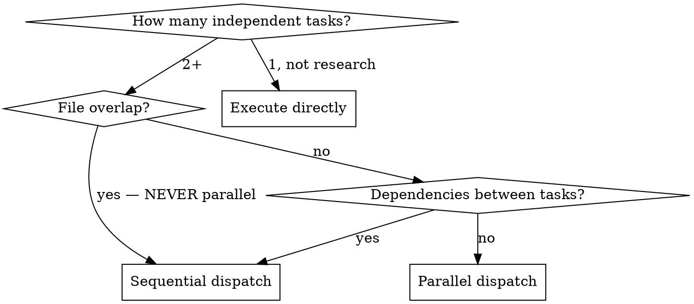

# Ultrawork

Decompose work into independent tasks, route to appropriate models, dispatch as parallel subagents. Subagents protect your context window — even a single research task benefits from isolation.

## When to dispatch



Single research/exploration task: still use a subagent for context isolation.

## Quick reference

| Route | Condition | Agent tool |
|-------|-----------|------------|
| **Parallel** | Independent tasks, no shared files | Multiple `Agent()` calls in one message |
| **Sequential** | Task B needs output from A, or shared files | One `Agent()` at a time |
| **Background** | Long-running (builds, tests, installs >30s) | `run_in_background: true` |
| **Direct** | Single simple task, no context isolation needed | No subagent |

## Model routing

| Model | When |
|-------|------|
| **opus** | Architecture, multi-file refactors, deep analysis, code review |
| **sonnet** | Single-file changes, straightforward implementation, docs, lookups |

Always set `model` explicitly. Never use haiku.

## Workflow

### 1. Decompose

Break the request into atomic subtasks. For each: specific goal, file scope, model tier, parallel or sequential.

### 2. Check the hard rule

**Two subagents must NOT modify the same file.** If they would, make them sequential or merge into one task.

### 3. Present plan

```
Ultrawork plan (N tasks):

PARALLEL:
1. [opus] Refactor auth middleware — src/auth/
2. [sonnet] Add validation tests — tests/validation/
3. [sonnet] Update API docs — docs/api.md

SEQUENTIAL (after parallel):
4. [sonnet] Integration test — tests/integration/

Dispatching...
```

Announce the plan for transparency, then immediately dispatch. Do not wait for confirmation.

### 4. Dispatch

Fire all parallel tasks in a **single message**. Each prompt must be self-contained:

- **TASK**: Atomic goal
- **CONTEXT**: File paths, patterns, constraints
- **MUST NOT**: Don't modify files outside scope, don't commit

### 5. Collect and verify

Summarize results, run build/test, report to user. If any failed, report and suggest next steps.

## Common mistakes

- **Parallelizing tasks that share files** — #1 failure mode. Always check file scope before dispatching.
- **Assuming session context** — Subagent prompts must be self-contained. They don't inherit your conversation.
- **Using opus for trivial work** — A typo fix doesn't need opus. Route by complexity.
- **Running everything sequentially** — If tasks are independent, parallel dispatch is 3-5x faster.
- **Skipping the plan step** — User confirmation prevents wasted work on misunderstood decomposition.
